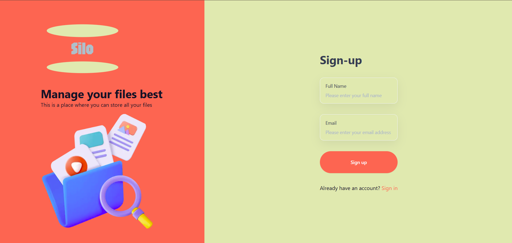
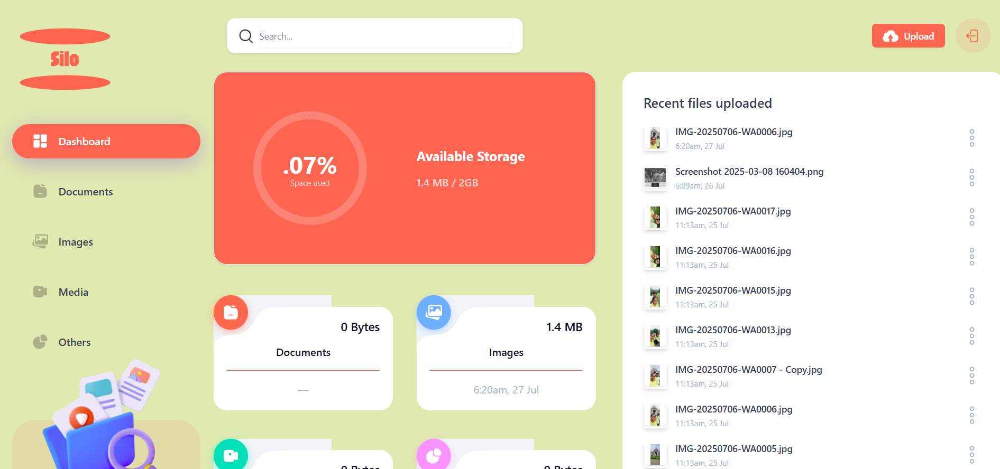

# Silo

Silo is a personal cloud storage application that lets you upload, manage, and share files seamlessly. Built with Next.js, React, and Appwrite, Silo offers a clean, responsive interface for handling documents, images, and media.

## Table of Contents

- [Features](#features)
- [Tech Stack](#tech-stack)
- [Getting Started](#getting-started)
  - [Prerequisites](#prerequisites)
  - [Installation](#installation)
  - [Environment Variables](#environment-variables)
  - [Running Locally](#running-locally)
- [Usage](#usage)
- [Project Structure](#project-structure)
- [Screenshots](#screenshots)
- [Contributing](#contributing)
- [License](#license)

## Features

- **Email-based Authentication**: Sign up or sign in with OTP verification—no passwords required.
- **File Upload & Storage**: Upload files of any type directly to Appwrite Storage.
- **Categorized File Views**: Browse files by Documents, Images, Media, or Others.
- **Search & Sort**: Quickly find files by name and sort by date or size.
- **File Sharing**: Share files with other users by email.
- **Storage Visualization**: View your used versus available storage with a responsive radial chart.
- **Responsive Design**: Mobile-friendly UI built with Radix UI components and Tailwind CSS.

## Tech Stack

- **Framework**: Next.js 15 (App Router)
- **Language**: TypeScript & React 19
- **Styling**: Tailwind CSS & PostCSS
- **UI Components**: Radix UI, Lucide Icons
- **Forms & Validation**: React Hook Form, Zod
- **Backend & Storage**: Appwrite (Authentication, Database, Storage)
- **Charts**: Recharts

## Getting Started

### Prerequisites

- [Node.js](https://nodejs.org/) (v18 or higher)
- npm or Yarn
- An [Appwrite](https://appwrite.io/) instance (self-hosted or cloud)

### Installation

1. **Clone the repository**

   ```bash
   git clone https://github.com/badalraj444/Silo.git
   cd Silo
   ```

2. **Install dependencies**

   ```bash
   npm install
   # or
   yarn install
   ```

3. **Configure Environment Variables**

   Copy the example environment file and fill in your Appwrite settings:

   ```bash
   cp .env.example .env.local
   ```

   Update `.env.local` with:

   ```env
   NEXT_PUBLIC_APPWRITE_ENDPOINT=<Your Appwrite endpoint URL>
   NEXT_PUBLIC_APPWRITE_PROJECT=<Your Appwrite project ID>
   NEXT_PUBLIC_APPWRITE_DATABASE=<Your Appwrite database ID>
   NEXT_PUBLIC_APPWRITE_USERS_COLLECTION=<Users collection ID>
   NEXT_PUBLIC_APPWRITE_FILES_COLLECTION=<Files collection ID>
   NEXT_PUBLIC_APPWRITE_BUCKET=<Storage bucket ID>
   NEXT_APPWRITE_KEY=<Appwrite secret key>
   ```

### Running Locally

Start the development server:

```bash
npm run dev
# or
yarn dev
```

Open your browser to [http://localhost:3000](http://localhost:3000) to see the app.

## Usage

- **Sign Up / Sign In**: Create an account with your email; verify via OTP sent to your inbox.
- **Upload Files**: Click the upload button, select files, and watch your storage update.
- **Browse & Search**: Navigate between categories, search by filename, or sort by date/size.
- **Share Files**: Use the actions menu on any file card to share with another user's email.
- **Monitor Storage**: Check the radial chart on the dashboard to see your used vs. total storage.

## Project Structure

```
├── app/                  # Next.js App Router pages and layouts
│   ├── (auth)/           # Authentication routes (sign-in, sign-up)
│   ├── (root)/           # Main app routes and file type filters
│   └── globals.css       # Global styles
├── components/           # Reusable UI components
├── lib/                  # Appwrite client setup, actions, and utilities
├── public/               # Static assets (favicon, images, screenshots)
├── types/                # Custom TypeScript definitions
├── .env.example          # Example environment variables
├── next.config.ts        # Next.js configuration
├── package.json          # Project metadata & scripts
└── tsconfig.json         # TypeScript configuration
```

## Screenshots



## Live demo
https://silo-sigma.vercel.app/


## Contributing

Contributions are welcome! Feel free to open issues or submit pull requests for bug fixes and new features.

## License

Distributed under the MIT License. See [LICENSE](LICENSE) for more information.

