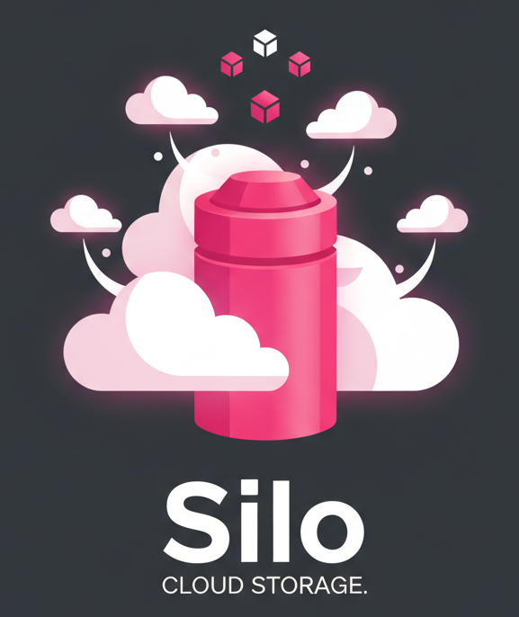
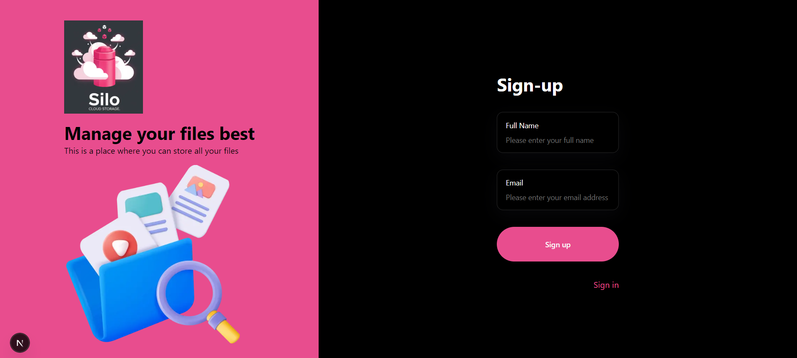
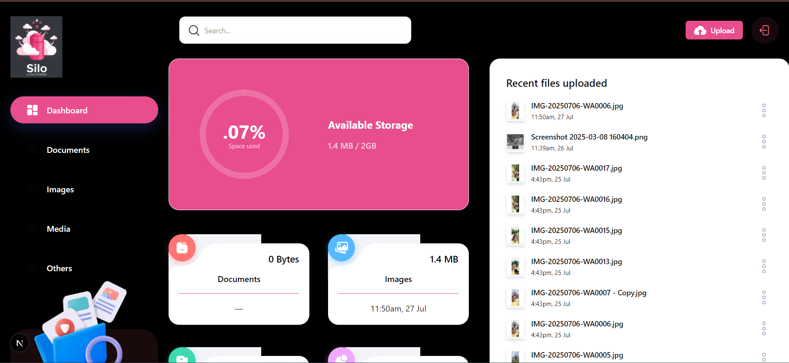

#  Cloud Storage
**Seamless Cloud Storage — Upload, Manage & Share Files with Ease**


[](https://github.com/badalraj444/Silo)
[](https://github.com/badalraj444/Silo/fork)
[](https://github.com/badalraj444/Silo/issues)
[](LICENSE)
[](http://makeapullrequest.com)

---

## 🚀 Live Demo
🔗 **[Try Silo here](https://silo-sigma.vercel.app/)**

---

## ✨ Features
- 📧 **Email-based Authentication** – Sign in or sign up with OTP verification; no passwords required.  
- 📂 **File Upload & Storage** – Upload files of any type directly to Appwrite Storage.  
- 🗂 **Categorized File Views** – Browse files by Documents, Images, Media, or Others.  
- 🔍 **Search & Sort** – Quickly find files and sort by date or size.  
- 📤 **File Sharing** – Share files with other users by email.  
- 📊 **Storage Visualization** – Responsive radial chart to track storage usage.  
- 📱 **Responsive Design** – Mobile-friendly UI with Radix UI + Tailwind CSS.

---

## 🛠 Tech Stack

**Frontend & Framework**
- Next.js 15 (App Router)  
- TypeScript & React 19  

**Styling & UI**
- Tailwind CSS + PostCSS  
- Radix UI, Lucide Icons  

**Forms & Validation**
- React Hook Form, Zod  

**Backend & Storage**
- Appwrite (Authentication, Database, Storage)  

**Charts**
- Recharts  

---

## 📦 Getting Started

### Prerequisites
- Node.js (v18 or higher)  
- npm or Yarn  
- An [Appwrite](https://appwrite.io/) instance

### Installation

1. **Clone the repo**
```bash
git clone https://github.com/badalraj444/Silo.git
cd Silo
```

2. **Install dependencies**
```bash
npm install
# or
yarn install
```

3. **Configure Environment Variables**
Copy example file and set your Appwrite credentials:
```bash
cp .env.example .env.local
```
```env
NEXT_PUBLIC_APPWRITE_ENDPOINT=<Your Appwrite endpoint URL>
NEXT_PUBLIC_APPWRITE_PROJECT=<Your Appwrite project ID>
NEXT_PUBLIC_APPWRITE_DATABASE=<Your Appwrite database ID>
NEXT_PUBLIC_APPWRITE_USERS_COLLECTION=<Users collection ID>
NEXT_PUBLIC_APPWRITE_FILES_COLLECTION=<Files collection ID>
NEXT_PUBLIC_APPWRITE_BUCKET=<Storage bucket ID>
NEXT_APPWRITE_KEY=<Appwrite secret key>
```

4. **Run locally**
```bash
npm run dev
# or
yarn dev
```
Visit **http://localhost:3000**

---

## 📖 Usage
1. **Sign Up / Sign In** – OTP-based authentication via email.  
2. **Upload Files** – Add documents, images, or media instantly.  
3. **Browse & Search** – Navigate categories or search files by name.  
4. **Share Files** – Share directly via email.  
5. **Track Storage** – View remaining capacity on the dashboard.


---

## 📷 Snapshots

**Authentication Page**  


**Dashboard**  


---

## 📜 License
Distributed under the MIT License. See [LICENSE](LICENSE) for details.

---

⭐ **If you like Silo, please consider giving it a star on GitHub — it helps more people discover the project!** ⭐

---

<!-- keywords: silo, cloud storage, file management, nextjs file storage, appwrite storage, file upload app -->
