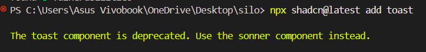

#Bugs

## Setting up lint and prettier -190725 9pm

- got dependency tree conflict error when installing eslint and prettier
- reason: the version of eslint and prettier were not compatible with the current version of nextjs
- !solution: restarted the project with an old version of next js --failed later
- command: `npx create-next-app@15.0.2`  

## Setting up lint and prettier -190725 11pm

- found critical error, and app crashed
- reason: next js older vesion was not safe and had security issues, not allowed to use it
- solution: updated next js to the latest version
- command: `npx create-next-app@latest`
- the problem of dependency tree conflict error reappeared, it was because the latest version of next js needs set up of eslint and prettier in a different way (updated way)
- a tutorial is available on youtube, https://www.youtube.com/watch?v=Mloeq7mvI00&t=13s
- the lint config file is now `eslint.config.mjs` instead of `.eslintrc.json`

## Both eslint and tailwind css have updated their versions. --2007 12pm
- the use guide has changed so much
- soln: for eslint, i followed a youtube tutorial on latest version : https://www.youtube.com/watch?v=Mloeq7mvI00&t=13s
- for tailwind css, i went throught the updated documentation of v4 , it showed we dont need separate config.js file, .css file is enough 
- the use guide of tailwind css is changed now.

## sometimes the tailwind is not working

## eslint for tailwind v4 is under development, beta vesion is available temporarily

## styling crash
- tailwind css global.css file is not working properly.
- due to version change
- !important in @apply needed to be removed. 
- still many errors
- i should learn tailwind css v4 first, then come back to this project

## sign in(even sign up) is not working properly, in edge case: usr already registered, otherwise fine, sometimes it works
- log: TypeError: fetch failed
    at async getCurrentUser (lib\actions\user.actions.ts:105:17)
    at async layout (app\(root)\layout.tsx:9:24)
  103 |     const result = await account.get();
  104 |
> 105 |     const user = await databases.listDocuments(
      |                 ^
  106 |       appwriteConfig.databaseId,
  107 |       appwriteConfig.usersCollectionId,
  108 |       [Query.equal("accountId", result.$id)], {
  [cause]: [Error [ConnectTimeoutError]: Connect Timeout Error (attempted addresses: 151.101.131.52:443, 151.101.3.52:443, 151.101.67.52:443, 151.101.195.52:443)] {
    code: 'UND_ERR_CONNECT_TIMEOUT'
  }
}
## email verification took too long to work
- could be slow network issue

## create user failed , worked earlier, now failed
- reason: the database schema was deleted by mistake while trying to delete only the records
- solution: recreated the database schema, and reconnected the database
## nextjs framework failed, while i set image src to foreign url
- reason: nextjs image component does not allow foreign urls, it needs to be configured in next.config.js file
- solution: added the foreign url to the next.config.js file.

## sign in took so long to do something after otp verification modal clear
- it felt like hang
- but it did render home page, but very late
- logs: Error: No session
    at createSessionClient (lib\appwrite\index.ts:14:40)
    at async getCurrentUser (lib\actions\user.actions.ts:101:35)
    at async layout (app\(root)\layout.tsx:9:24)
  12 |   const session = (await cookies()).get("appwrite-session");
  13 |
> 14 |   if (!session || !session.value) throw new Error("No session");
     |                                        ^
  15 |
  16 |   client.setSession(session.value);
  17 |
 GET / 307 in 17467ms
 GET /sign-in 200 in 12457ms
 ○ Compiling /favicon.ico ...
 ✓ Compiled /favicon.ico in 759ms
 GET /favicon.ico 200 in 1396ms
 POST /sign-in 200 in 16447ms
 POST /sign-in 200 in 5753ms
 GET / 200 in 10425ms
 GET / 200 in 11761ms

 ## (upload files section)The toast component is deprecated. Use the sonner component instead.
 - shadcn ui toast is deprecated
 - 

 ## App crashed (Fetch failed), but not all the time
 - reason: the getuser function was not working properly:it said user not found 
 - bug: i made the parsestring fun async by mistake. this caused appearing the code that user was not found. it did not wait for proper report
 - soln: i removed the async word

 ## still, the app crashed surprisingly once in a while
 - this time it says user not authorised
 - also user not found
 - seems the earlier bug is not fixed
 --- parallel fetch request could be a problem?
 - checked code with reference, no difference found
 - could be due to fast fetching
 ------ could be due to static attempt of rendering
 